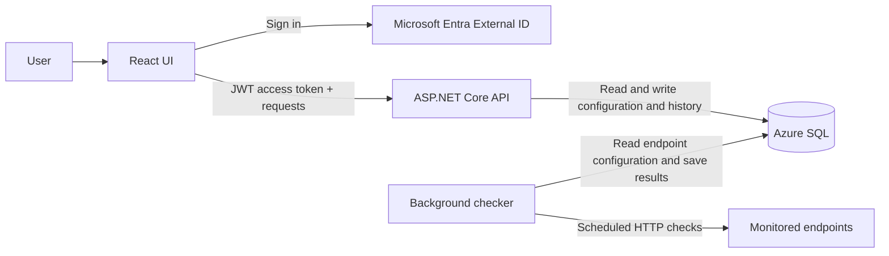

# Cloud_API_Reliability_Dashboard
Build a small app that checks a few configured API endpoints and shows whether they’re responding, how long they take, and how that changes over time.

## Planned MVP
- An ASP.NET Core API manages monitored endpoints and check history.
- A background service checks each endpoint on a schedule, with timeouts and basic retry handling.
- Azure SQL stores endpoint details and check results.
- A React page shows current status and a simple latency history.
- Users sign in through Microsoft Entra External ID. The React app sends JWT access tokens with API requests.
- A CI/CD pipeline deploys the application.

## Basic architecture

| Part | Responsibility |
| --- | --- |
| React UI | Lets users manage monitored endpoints and view current status and latency history. Users sign in through Microsoft Entra External ID and send JWT access tokens with API requests. |
| ASP.NET Core API | Validates access tokens, manages endpoint configuration, and returns status and check history to the UI. |
| Background checker | Runs on a schedule, calls each monitored endpoint with a timeout and basic retry handling, and saves each result. For the MVP, it can run as a hosted service in the API application. |
| Azure SQL | Stores monitored endpoint details and check results. The API and checker share the application's data access code. |



The API serves user requests; the background checker performs scheduled checks independently of the UI. After a check is saved, the UI gets the latest status and latency history through the API. A CI/CD pipeline will build and deploy the API and UI.

This describes the intended architecture. The ASP.NET Core API can already create and list endpoints and return their check history, backed by SQL Server through EF Core with a migration. `CheckResultService.SaveCheckResultAsync` is the entry point the background checker will call to save results. The background checker, authentication, and the UI are still planned.

## Check behavior and data

- **Schedule:** Each endpoint is checked every [TBD].
- **Success:** A check succeeds when [TBD, such as an HTTP 2xx response].
- **Timeout:** Each attempt stops after [TBD].
- **Retries:** Failed attempts are retried [TBD] times.
- **Stored result:** Endpoint ID, check time, success/failure, HTTP status (if received),
  response time, and error details (if applicable).

## Configuration and secrets

Monitored endpoint settings will be managed through the API and stored in Azure SQL. The API reads its SQL Server connection string from `ConnectionStrings:DefaultConnection`. For local development, store the local SQL Server connection string in .NET user secrets, which are loaded when the API runs in the `Development` environment. In deployment, supply a separate Azure SQL connection string as the `ConnectionStrings__DefaultConnection` environment variable. Keep connection strings and other secrets out of source control. The method for storing endpoint credentials is still TBD.

## API routes

| Method and path | Behavior |
| --- | --- |
| `GET /health` | Returns `{ "status": "ok" }`. Does not test the database connection. |
| `POST /endpoints` | Body `{ "url": "https://example.com/" }`. Returns `201` with `{ "id": <id> }`, or `400` if the URL is not an absolute http or https URL. |
| `GET /endpoints` | Lists monitored endpoints as `{ id, url }`, ordered by id. |
| `GET /endpoints/{id}/checks` | Returns the latest 50 check results for the endpoint, newest first, each with `id`, `endpointId`, `checkTimeUtc`, `success`, `latencyMs`, and `httpStatusCode`. Returns `404` if the endpoint does not exist. |

Check results are saved through `CheckResultService.SaveCheckResultAsync`, which stamps the current UTC time. It is registered in dependency injection for the background checker to use later; no route calls it.

## Local development

The API project targets .NET 10. The planned full application also requires Node.js and npm for the React UI and a Microsoft Entra External ID development tenant for sign-in. Docker is a convenient way to run a local SQL Server database.

To run the API, install the .NET 10 SDK and store your local SQL Server connection string with .NET user secrets. For a SQL Server container listening on port 1433, run this from the repository root, replacing `<local-password>` with its password. Set the environment to `Development` so the API loads user secrets:

```powershell
dotnet user-secrets set "ConnectionStrings:DefaultConnection" "Server=localhost,1433;Database=CloudApiReliabilityDashboard;User Id=sa;Password=<local-password>;Encrypt=True;TrustServerCertificate=True" --project api
$env:DOTNET_ENVIRONMENT = "Development"
dotnet run --project api
```

The API registers `AppDbContext` with EF Core's SQL Server provider. The connection string is required at startup. Set `ConnectionStrings__DefaultConnection` in the deployment environment to the Azure SQL connection string; do not reuse the local value.

1. Start a SQL Server container, then create or update the database schema with the EF Core migrations. Install the EF Core tool once with `dotnet tool install --global dotnet-ef`, then run:

   ```powershell
   dotnet ef database update --project api
   ```

   Azure SQL will be used in the deployed environment.
2. Run the API (see above), then try the routes on the URL printed by the application. For example:

   ```powershell
   Invoke-RestMethod -Method Post -Uri http://localhost:<port>/endpoints -ContentType "application/json" -Body '{"url":"https://example.com/"}'
   Invoke-RestMethod http://localhost:<port>/endpoints
   ```

3. Configure Entra settings when authentication is added. The background checker will run with the API as a hosted service.
4. Configure the UI's API URL and Entra settings, then start the React development server and sign in through the UI.

Commands and configuration names for authentication and the UI will be added when those parts are implemented.

## Tests

The tests live in `tests/CloudApiReliabilityDashboard.Api.Tests`. Service tests cover `CheckResultService`, and route tests run the API through `WebApplicationFactory`. Both use an in-memory SQLite database, so they need no SQL Server and no user secrets.

```powershell
dotnet test tests/CloudApiReliabilityDashboard.Api.Tests
```
