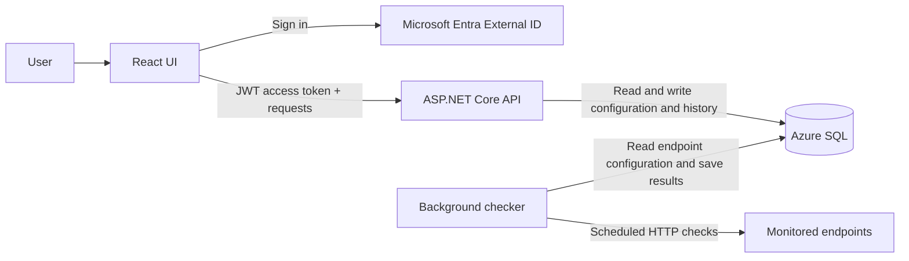

# Cloud_API_Reliability_Dashboard
Build a small app that checks a few configured API endpoints and shows whether they’re responding, how long they take, and how that changes over time.

## Planned MVP
- An ASP.NET Core API manages monitored endpoints and check history.
- A background service checks each endpoint on a schedule, with timeouts and basic retry handling.
- Azure SQL stores endpoint details and check results.
- A React page shows current status and a simple latency history.
- Users sign in through Microsoft Entra External ID. The React app sends JWT access tokens with API requests.
- A CI/CD pipeline deploys the application.

## Basic architecture

| Part | Responsibility |
| --- | --- |
| React UI | Lets users manage monitored endpoints and view current status and latency history. Users sign in through Microsoft Entra External ID and send JWT access tokens with API requests. |
| ASP.NET Core API | Validates access tokens, manages endpoint configuration, and returns status and check history to the UI. |
| Background checker | Runs on a schedule, calls each monitored endpoint with a timeout and basic retry handling, and saves each result. For the MVP, it can run as a hosted service in the API application. |
| Azure SQL | Stores monitored endpoint details and check results. The API and checker share the application's data access code. |

The API serves user requests; the background checker performs scheduled checks independently of the UI. After a check is saved, the UI gets the latest status and latency history through the API. A CI/CD pipeline will build and deploy the API and UI.

This describes the intended architecture; implementation has not started yet.

## Check behavior and data

- **Schedule:** Each endpoint is checked every [TBD].
- **Success:** A check succeeds when [TBD, such as an HTTP 2xx response].
- **Timeout:** Each attempt stops after [TBD].
- **Retries:** Failed attempts are retried [TBD] times.
- **Stored result:** Endpoint ID, check time, success/failure, HTTP status (if received),
  response time, and error details (if applicable).

  ## Configuration and secrets

Monitored endpoint settings will be managed through the API and stored in Azure SQL. Application settings will come from the deployment environment. The method for storing endpoint credentials is still TBD; credentials and other secrets must not be committed to source control.

## Local development (planned)

The expected prerequisites are a .NET SDK for the ASP.NET Core API, Node.js and npm for the React UI, Docker for a local SQL Server database, and a Microsoft Entra External ID development tenant for sign-in. Supported versions will be specified when the applications are created.

1. Start a SQL Server container and initialize the database schema using the project's setup or migration command once available. Azure SQL will be used in the deployed environment.
2. Configure the API's database connection and Entra settings through local environment variables or .NET user secrets, then start the API. The background checker will run with the API as a hosted service.
3. Configure the UI's API URL and Entra settings, then start the React development server and sign in through the UI.

Exact commands and configuration names will be added when the API and UI are implemented. No services are runnable from this repository yet.
