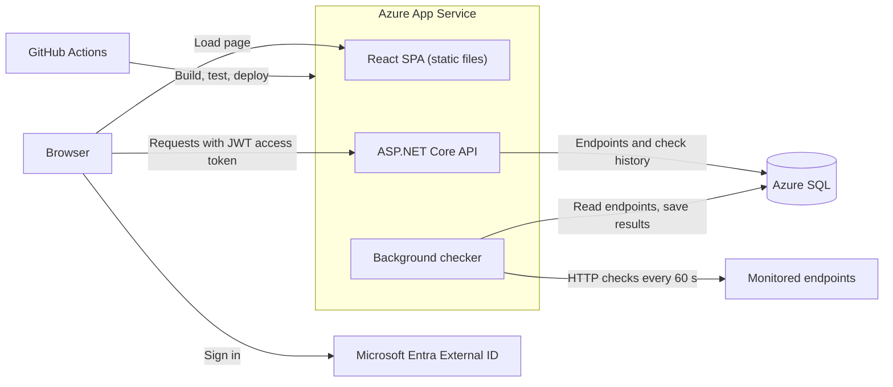

# Cloud API Reliability Dashboard

A small cloud-native app that monitors HTTP endpoints. Add a URL and a background checker calls it every minute. The dashboard shows whether it's up, its HTTP status and latency, and a latency chart for the last 50 checks.

**Live demo:** https://apidash-yw-hdehg7bbfkhaf3f2.canadaeast-01.azurewebsites.net. Sign in or create an account with any email address.

**Stack:** ASP.NET Core (.NET 10) minimal API, EF Core, Azure SQL Database, React 19 + TypeScript (Vite), Microsoft Entra External ID (MSAL.js), Azure App Service, GitHub Actions.

## Features

- Sign in and sign out through Microsoft Entra External ID. The API rejects requests without a valid access token.
- Add and delete monitored endpoints from the dashboard. Invalid and duplicate URLs are rejected with a clear message.
- A background checker calls each endpoint on a schedule, with a per-attempt timeout and retries for server errors and network failures.
- For each endpoint the dashboard shows current status (up/down, HTTP status, latency, time of last check) and a latency chart with failed checks marked in red. It refreshes every 30 seconds.
- Every push to `main` builds, tests and deploys the app to Azure App Service.

## Architecture



| Part | Responsibility |
| --- | --- |
| React SPA (`web/`) | Signs users in with MSAL.js, calls the API with the access token, and shows status and latency history. Built by Vite and served by the API from `wwwroot`. |
| ASP.NET Core API (`api/`) | Validates Entra access tokens (Microsoft.Identity.Web) and exposes the endpoint and check-history routes. Serves the SPA's static files ahead of the auth middleware so the page itself loads without a token. |
| Background checker | `EndpointCheckWorker`, a hosted service in the same app. It checks all endpoints concurrently on each tick and saves one result per endpoint. |
| Azure SQL | Serverless database holding endpoints and check results, accessed through EF Core with migrations. |
| GitHub Actions | `.github/workflows/deploy.yml`: builds the SPA, runs the tests, publishes the API with the SPA in `wwwroot`, and deploys to App Service. |

## How checks work

- **Schedule:** each endpoint is checked every 60 seconds (`Checker:IntervalSeconds`). The first check runs one interval after the app starts.
- **Success:** a check succeeds when the final attempt gets an HTTP status from 200 to 399.
- **Timeout:** each attempt stops after 5 seconds (`Checker:TimeoutSeconds`).
- **Retries:** a 5xx response, network error or timeout is retried up to 2 times (`Checker:MaxRetries`), waiting 1 second and then 2 seconds. A 4xx response is not retried, because retrying won't change it.
- **Stored result:** one row per check: endpoint ID, check time (UTC), success, HTTP status (null if no response arrived), and the final attempt's latency.
- **Isolation:** if checking or saving one endpoint fails, the error is logged and the other endpoints are unaffected.

All `Checker` settings live in `api/appsettings.json` and can be overridden with environment variables such as `Checker__IntervalSeconds=30`. Set `Checker__Enabled=false` to run the API without the checker.

## API routes

Every `/endpoints` route requires an `Authorization: Bearer <access token>` header and returns `401` without one.

| Method and path | Behavior |
| --- | --- |
| `GET /health` | Returns `{ "status": "ok" }`. Anonymous. Doesn't test the database. |
| `GET /endpoints` | Lists monitored endpoints as `{ id, url }`, ordered by id. |
| `POST /endpoints` | Body `{ "url": "https://example.com/" }`. Returns `201` with `{ "id": <id> }`. Returns `400` if the URL isn't an absolute http or https URL, and `409` if it's already monitored. URLs are compared after normalization, so `https://example.com` and `https://example.com/` are the same. Errors come back as `{ "error": "<message>" }`. |
| `DELETE /endpoints/{id}` | Deletes the endpoint and its check history. Returns `204`, or `404` if it doesn't exist. |
| `GET /endpoints/{id}/checks` | Returns the latest 50 check results, newest first, each with `id`, `endpointId`, `checkTimeUtc`, `success`, `latencyMs` and `httpStatusCode`. Returns `404` if the endpoint doesn't exist. |

## Deployment

The app runs as a single Linux Azure App Service Web App (.NET 10). The API and the SPA ship together, so the browser talks to one origin and no CORS setup is needed.

On every push to `main` (or a manual run), [the workflow](.github/workflows/deploy.yml):

1. Sets up Node 22 and .NET 10.
2. Runs `npm ci && npm run build` in `web/`. The TypeScript type check is part of the build.
3. Runs the test project. A failing test stops the deploy.
4. Runs `dotnet publish` on the API and copies `web/dist` into the output's `wwwroot`.
5. Deploys the output with `azure/webapps-deploy` using a publish profile.

To deploy your own copy, it needs:

| Where | Setting |
| --- | --- |
| GitHub repository secret | `AZURE_WEBAPP_PUBLISH_PROFILE`: the Web App's publish profile XML. The Web App needs "SCM Basic Auth Publishing Credentials" turned on. |
| GitHub repository variable | `AZURE_WEBAPP_NAME`: the Web App's name. |
| Web App → Environment variables → Connection strings | `DefaultConnection` (type `SQLAzure`): the Azure SQL connection string. |
| Azure SQL server → Networking | "Allow Azure services and resources to access this server" turned on. |
| Entra app registration for the SPA | The Web App's URL added as a Single-page application redirect URI. |

The Entra settings (`AzureAd` in `api/appsettings.json` and the MSAL config in `web/src/auth.ts`) contain only public identifiers and are committed. The connection string is the only secret, and it lives in App Service settings and local user secrets, never in the repo. Schema changes are applied with `dotnet ef database update`; the pipeline doesn't run migrations.

## Local development

Prerequisites: .NET 10 SDK, Node.js 22.12 or later, the EF Core tool (`dotnet tool install --global dotnet-ef`), and a SQL Server database. A SQL Server Docker container works, as does an Azure SQL database.

1. **Store the connection string** in .NET user secrets. It never goes in `appsettings.json`.

   ```powershell
   dotnet user-secrets set "ConnectionStrings:DefaultConnection" "<connection string>" --project api
   ```

   For a local SQL Server container, the connection string looks like `Server=localhost,1433;Database=CloudApiReliabilityDashboard;User Id=sa;Password=<local-password>;Encrypt=True;TrustServerCertificate=True`.

2. **Create the schema:**

   ```powershell
   dotnet ef database update --project api
   ```

3. **Run the API.** The launch profile serves it on http://localhost:5000 in the `Development` environment, which loads user secrets.

   ```powershell
   dotnet run --project api
   ```

   If your local API points at the same database as production, run it with `$env:Checker__Enabled = "false"`. Otherwise both checkers write results and every endpoint is checked twice.

4. **Run the web app:**

   ```powershell
   cd web
   npm ci
   npm run dev
   ```

   Open http://localhost:5173. Vite proxies `/endpoints` requests to the API on port 5000. Keep port 5173, because it's the registered sign-in redirect URI.

Sign-in uses this project's Entra External ID tenant. To use your own, register an API app (exposing an `access_as_user` scope) and a SPA app. Then update `AzureAd` in `api/appsettings.json`, and `clientId`, `authority` and `apiScopes` in `web/src/auth.ts`. External ID authorities use `https://<subdomain>.ciamlogin.com/<tenant-id>/`.

## Tests

```powershell
dotnet test tests/CloudApiReliabilityDashboard.Api.Tests
```

The 17 tests need no SQL Server, no secrets and no network. They take a few seconds, because the worker tests wait on real retry delays and timeouts.

- **Route tests** run the whole API in memory with `WebApplicationFactory`. They swap SQL Server for in-memory SQLite and Entra token validation for a fake auth scheme. They cover creating, listing and deleting endpoints, duplicate and invalid URLs, check-history ordering, `404`s, and `401` without a token.
- **Worker tests** run `EndpointCheckWorker` against stub HTTP handlers. They cover retry after a 500, giving up after repeated 500s, and timing out when no response arrives.
- **Service tests** cover how `CheckResultService` saves check results.

## Design decisions

- **The SPA is served by the API.** One deployable, one origin, no CORS configuration. Static files are mapped before authentication, so the page loads anonymously and the data routes stay protected.
- **The checker runs inside the API process.** This is simple for a single instance. The trade-off is that scaling out to more instances would check every endpoint once per instance (see next steps).
- **Duplicate URLs are rejected in code, not by a unique index.** `Url` is `nvarchar(max)`, which SQL Server can't index, and existing data already had duplicates.
- **SQL retries are on.** `EnableRetryOnFailure` covers the delay while a paused serverless database resumes.
- **Deleting cascades in the database.** Check results are removed through the foreign key's `ON DELETE CASCADE`, with no extra query in the API.

## Limitations and next steps

- **Shared endpoint list:** all signed-in users see and manage the same endpoints. Next: store an owner from the token's `oid` claim and filter by it.
- **Single-instance checker:** move it to an Azure Functions timer or WebJob, or add a lease so only one instance checks.
- **Credentials:** replace the SQL login with a managed identity, and the publish profile with GitHub OIDC federated credentials.
- **Data growth:** each endpoint adds about 1,440 rows a day. Add a retention job or roll old rows up into hourly summaries.
- **Monitoring:** add alerts when an endpoint goes down, Application Insights, and stored error details for failed checks.
- **Infrastructure:** the Azure resources were created in the portal. Describe them in Bicep and run migrations from the pipeline.
- **Free-tier hosting:** on an App Service plan without Always On, the app sleeps when idle and the checker pauses until the next request.

## Repository layout

```
api/                ASP.NET Core API, background checker, EF Core model and migrations
web/                React + TypeScript SPA (Vite)
tests/              xUnit tests for the API, worker and services
.github/workflows/  Build, test and deploy pipeline
```

## License

MIT. See [LICENSE](LICENSE).
